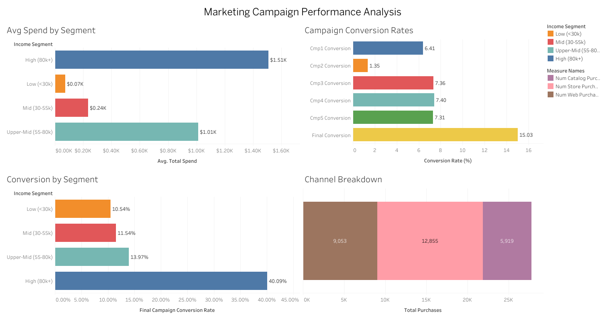

# Marketing Campaign Performance Analysis
### Power Query · PostgreSQL · Tableau Public · Excel

**By Jasmine Unochi** · [LinkedIn](https://www.linkedin.com/in/jasmine-unochi-4613a3169) · [GitHub](https://github.com/unochifarah)

---

## Overview

This project analyzes 2,216 customers and 6 marketing campaigns from a retail company to answer one core business question: **which channels and customer segments deliver the best ROI?** Using Power Query to merge and clean multi-source data, PostgreSQL for funnel and ROI analysis, and Tableau for the executive dashboard, this is an end-to-end analytics pipeline from raw data to actionable insight.

---

## Tools Used

| Tool | Purpose |
|---|---|
| Excel + Power Query | Multi-source merge, data cleaning, feature engineering, pivot analysis |
| PostgreSQL | Conversion funnel analysis, ROI queries, segment profiling |
| Tableau Public | Interactive executive dashboard, 4-chart visual story |
| Excel Pivot Tables | Summary charts and KPI presentation |

---

## Business Questions Answered

- Which customer income segment spends the most and converts best?
- Which campaigns delivered the highest ROI and which wasted budget?
- What is the conversion rate at each stage of the campaign funnel?
- Which purchase channel drives the most transactions?
- Should marketing budget be shifted away from Social Media toward Email?

---

## Key Findings

- **High income customers (80k+) are the most valuable segment** — they spend $1,510 on average and convert at 40%, nearly 4x the rate of every other segment
- **Email is the best-performing channel** — Campaign 1 (Email) delivered a 1,586% ROI on just $12,500 spend; Campaign 4 (Email re-target) followed at 1,143%
- **Social Media Campaign 2 is the worst investment** — only 1.35% conversion rate and 40% ROI on $28,000 spend; budget should be reallocated
- **The Final Multi-Channel campaign doubled conversion rates** — 15% vs ~7% average for single-channel campaigns, confirming that warming up audiences across multiple touchpoints works
- **Store dominates purchase volume** at 46% of all transactions, despite Catalog campaigns showing decent conversion rates — customers respond to catalog but buy in-store
- **Campaign 3 (Catalog) costs the most per conversion** at $261 vs $81 for Email — high print/distribution cost with modest return

---

## Phase 1: Power Query — Data Cleaning & Merging

### What I Built
- Loaded and merged data, cleaned nulls (removed 24 customers with missing income), enforced data types
- 6 custom calculated columns: `Age`, `TotalSpend`, `TotalPurchases`, `TotalCampaignsAccepted`, `HasChildren`, `IncomeSegment`
- 17 documented transformation steps from raw CSV to clean master table

### Skills Demonstrated
- Power Query M code: `Table.NestedJoin`, `Table.ExpandTableColumn`, `Table.SelectRows`
- Conditional column logic: 4-tier income segmentation using nested `if/else`
- Data type enforcement and null handling
- Reproducible pipeline — refresh updates all downstream pivots automatically

---

## Phase 2: PostgreSQL — Funnel & ROI Analysis

### What I Built
- Loaded 2,216 cleaned records into PostgreSQL via `COPY` command
- Wrote 4 analytical queries: conversion funnel, channel breakdown, ROI by campaign, segment performance
- Created `campaign_costs` assumptions table to simulate real-world cost metadata

### Key Queries

**Conversion Funnel**
```sql
SELECT 'Campaign 1 (Email)' AS campaign, ROUND(AVG(acceptedcmp1)*100, 2) AS conversion_rate_pct FROM customers
UNION ALL
SELECT 'Final Campaign (Multi-Channel)', ROUND(AVG(response)*100, 2) FROM customers;
```

**ROI by Campaign**
```sql
SELECT cc.campaign, cc.channel, cc.cost_usd,
    ROUND((acceptors * avg_spend - cc.cost_usd) * 100.0 / cc.cost_usd, 1) AS roi_pct
FROM campaign_costs cc JOIN ...
```

### Skills Demonstrated
- `UNION ALL` for multi-row aggregation
- `CROSS JOIN` with conditional `CASE WHEN` for campaign-level attribution
- Window functions and CTEs for ROI calculation
- Assumption documentation for missing metadata

> **Note:** Campaign channel assignments and cost figures are assumed for analysis purposes as the dataset does not include campaign metadata. In production these would be sourced from the CRM or marketing platform.

---

## Phase 3: Tableau Public Dashboard

### What I Built
- 4 visualizations assembled into a 2x2 executive dashboard
- Calculated fields for campaign conversion rates
- Dual-axis combo chart for segment spend vs conversion rate

### Dashboard Preview
> 

### 🔗 [View Live on Tableau Public](https://public.tableau.com/views/MarketingCampaignPerformanceAnalysis_17796487020500/MarketingCampaignPerformanceAnalysis)

### Skills Demonstrated
- Tableau Public: multi-sheet dashboard assembly
- Calculated fields: `AVG([AcceptedCmp1]) * 100` style conversion metrics
- Measure Values / Measure Names for multi-series bar charts
- Dual-axis charts, secondary axis formatting, custom number formats

---

## Phase 4: Excel Pivot Tables

### What I Built
- 3 pivot tables with charts: Segment Analysis, Campaign Conversion Rates, Channel Purchase Volume
- Combo chart (column + line) for spend vs conversion rate by segment
- Summary cover sheet with key findings and Tableau link

### Skills Demonstrated
- PivotTable Value Field Settings (Sum → Average)
- Custom number formatting (`$#,##0.00,K` for thousands)
- Combo charts with secondary axis
- Clean dashboard layout across multiple sheets

---

## Repository Structure

```
marketing-campaign-analysis/
  README.md
  data/
    marketing_campaign.csv
  sql/
    marketing_analysis.sql
  excel/
    marketing_capstone.xlsx
  tableau/
    screenshots/
      dashboard.png
```

---

## Dataset

**Source:** Marketing Campaign Results (via Kaggle — rodsaldanha/arketing-campaign)  
**Records:** 2,216 customers (after cleaning)  
**Fields:** Demographics, spend by product category, purchase channel counts, campaign acceptance flags
